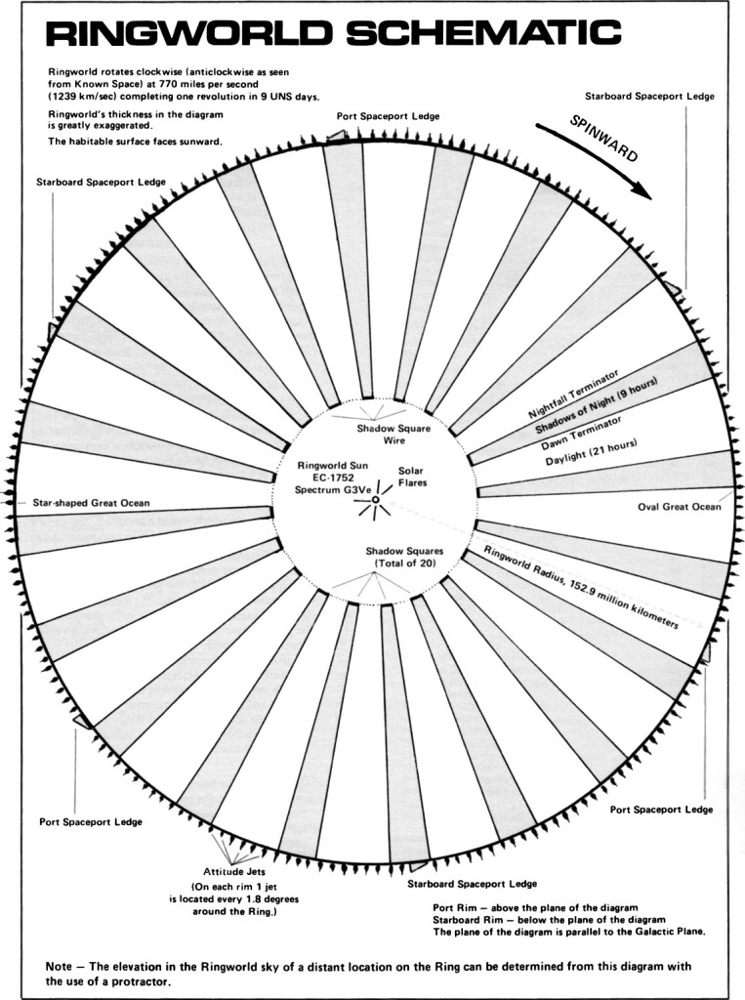

# Ringworld Renderer

> **Note**: This repository is significantly LLM-generated, although with careful prompting. The end goal is to be both visually interesting, and to have sufficiently modular, testable code, lending itself to manual validation and modification as a learning exercise.

A physics-accurate renderer for visualizing the visual experience of standing on a **Ringworld**—a megastructure with a radius of 1 AU rotating to provide centrifugal gravity, inspired by Larry Niven's "Ringworld" novels.



## What You'll See

This renderer accurately simulates the unique visual phenomena of a Ringworld:

- **The Upward Horizon** - Ground rises to become the sky, with the Arch visible overhead
- **Atmospheric Blue-Out** - Landscape fades into blue haze across thousands of miles
- **Night Walls** - Moving pillars of shadow cast by orbiting Shadow Squares
- **Ring-shine** - The night side glows with light from the illuminated Arch overhead
- **Rim Walls** - Massive 1,000-mile-high barriers framing the world at the horizon
- **Volumetric Shadowing** - Shadows appear three-dimensional in the atmosphere itself

## Quick Start

### Installation

```bash
# Clone the repository
git clone <repository-url>
cd ringworld_renders

# Install dependencies (requires Python 3.13+)
pip install uv
uv sync
```

### Basic Usage

```bash
# Launch interactive UI
uv run ringworld ui

# Generate high-quality sample images
uv run ringworld samples --res 2048

# Run physical consistency verification
uv run ringworld verify

# Visualize shadow square system
uv run ringworld visualize
```

The interactive UI provides real-time control over:
- Camera position (yaw, pitch, FOV)
- Time of day (watch the shadow squares move)
- Visual effects toggles (atmosphere, shadows, ring-shine)
- Resolution settings

## Key Features

### Physically Accurate

- **Observer-centric coordinates** prevent floating-point precision loss at astronomical scales
- **Delta-R intersection solver** maintains numerical stability across 11 orders of magnitude
- **Rayleigh atmospheric scattering** with proper wavelength dependence
- **Angular shadow calculations** for accurate day/night cycles

### Real-Time Rendering

- Interactive frame rates (30+ fps) for exploration
- Real-time shadow square animation
- Procedural terrain generation (no mesh limits)
- Single-pass atmospheric integration

### Visual Fidelity

- Continuous terrain from foreground to distant Arch (no seams)
- Soft shadow penumbra based on solar angular diameter
- Dynamic sky color responding to shadow state
- Volumetric shadowing in atmospheric haze

## Project Structure

```
src/ringworld_renders/
├── core.py          # Main Renderer class
├── intersections.py # Ray-geometry intersection calculations
├── shadows.py       # Shadow square physics and rendering
├── constants.py     # Physical constants
└── ui.py           # Gradio interface
```

## Documentation

- **[Technical Design](docs/TECHNICAL_DESIGN.md)** - Complete technical specification and design rationale
- **[Architecture](docs/ARCHITECTURE.md)** - System design, components, and data flow
- **[Physics Reference](docs/PHYSICS_REFERENCE.md)** - Physical parameters, constants, and equations
- **[Contributing](CONTRIBUTING.md)** - Development workflow and contribution guidelines

For developers: Start with [Contributing](CONTRIBUTING.md) for setup and workflow. For technical details, see [Architecture](docs/ARCHITECTURE.md) and [Technical Design](docs/TECHNICAL_DESIGN.md).

## Physical Parameters

The renderer uses Niven-scale parameters:

- **Ring Radius**: 92,955,807 miles (1 AU)
- **Ring Width**: 1,000,000 miles
- **Rim Wall Height**: 1,000 miles
- **Shadow Squares**: 8 squares in retrograde orbit creating 24-hour day/night cycle
- **Atmosphere**: 100-mile ceiling with Rayleigh scattering

See [Physics Reference](docs/PHYSICS_REFERENCE.md) for complete parameter tables and equations.

## Testing

```bash
# Run all tests
uv run pytest

# Run specific test suite
uv run pytest tests/test_visual_features.py
uv run pytest tests/test_sun_occlusion.py
```

## Acknowledgments

Inspired by Larry Niven's "Ringworld" novels. This project aims to answer: *"What would I actually see if I were standing on a Ringworld?"*

